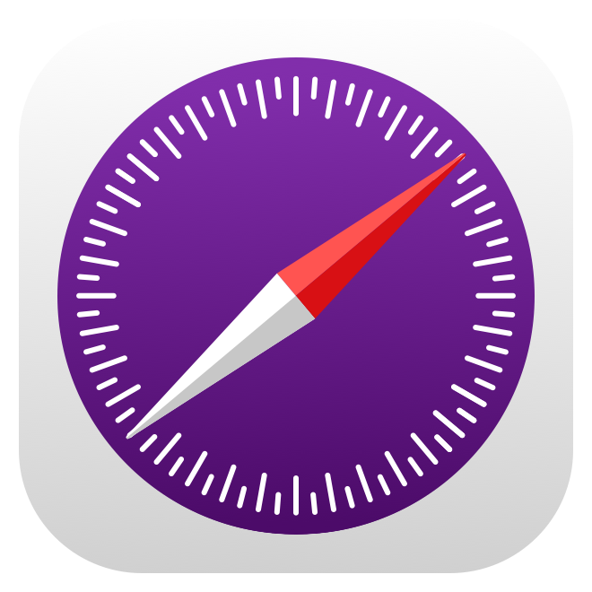

# &nbsp; nsswifter.github.io

This [GitHub Webpage](https://nsswifter.github.io/) serves as a portfolio showcasing various aspects of who I am :}

Explore this space to discover more about me and enjoy glimpses of some interesting facets of my work and interests.

```js
<!DOCTYPE html>
<html lang="en">
<head>
    <meta charset="UTF-8">
    <meta name="viewport" content="width=device-width, initial-scale=1.0">
    <title>Fruit Buttons</title>
    <style>
        body, html {
            margin: 0;
            padding: 0;
            height: 100%;
        }

        .container {
            display: flex;
            flex-wrap: wrap;
            height: 100%;
            justify-content: center;
            align-items: center;
        }

        .button {
            margin: 10px;
            padding: 10px 20px;
            font-size: 16px;
            background-color: lightgreen;
            border: none;
            cursor: pointer;
            transition: background-color 0.3s ease;
        }

        .button:hover {
            background-color: green;
            color: white;
        }
    </style>
</head>
<body>
    <div class="container" id="buttonContainer">
    </div>

    <script>
        const fruits = [
            "Apple", "Banana", "Orange", "Grapes", "Strawberry",
            "Pineapple", "Watermelon", "Kiwi", "Peach", "Mango",
            "Cherry", "Pear", "Plum", "Blueberry", "Raspberry",
            "Lemon", "Lime", "Coconut", "Avocado", "Pomegranate"
        ];

        function createButtons() {
            const buttonContainer = document.getElementById("buttonContainer");
            buttonContainer.innerHTML = ""; // Clear previous buttons

            fruits.forEach(fruit => {
                const button = document.createElement("button");
                button.className = "button";
                button.textContent = fruit;
                buttonContainer.appendChild(button);
            });
        }

        function adjustLayout() {
            const buttonContainer = document.getElementById("buttonContainer");
            if (window.innerWidth <= 500) { // Adjust this value according to your design
                buttonContainer.style.flexDirection = "column";
            } else {
                buttonContainer.style.flexDirection = "row";
            }
        }

        // Call functions on page load and resize
        window.onload = function() {
            createButtons();
            adjustLayout();
        };
        window.onresize = adjustLayout;
    </script>
</body>
</html>
```
